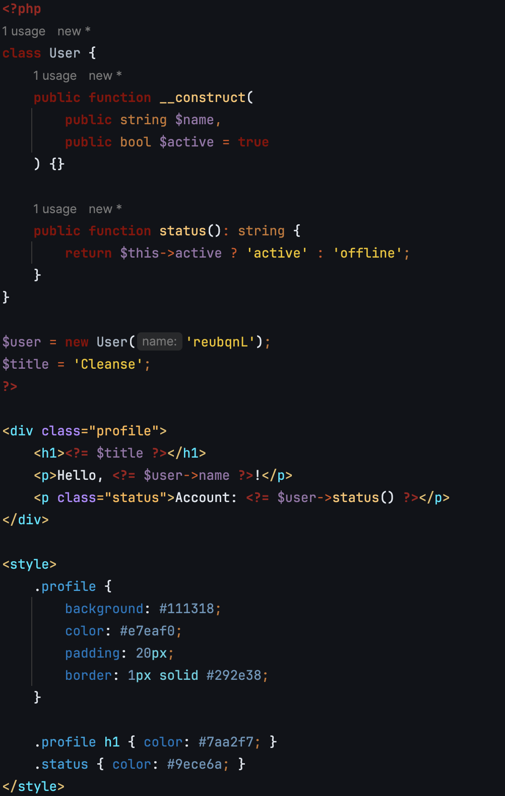

# Cleanse Color Scheme for JetBrains

**Cleanse** is a dark color scheme for JetBrains IDEs (PhpStorm, WebStorm, IntelliJ IDEA, PyCharm, and CLion). Built on top of Darcula, it replaces harsh grays with a deep slate canvas (`#111318`) and introduces beautiful color palettes designed for web development stacks.

---

## Features

* **Deep Slate Canvas:** Dark Slate background (`#111318`) paired with light grey text (`#E2E8F0`) to lower visual fatigue.
* **Cleared Template Noise:** Neutralized background tints for injected language fragments and template blocks, eliminating distracting background boxes inside code.
* **Language-Specific Color Signatures:**

  * **PHP:** Dark Red keywords and tags, Burnt Orange operators, Mint Green variables, and Warm Amber strings.
  * **JavaScript:** Orange and Gold palette for high visual distinction between keywords, variables, and function calls.
  * **CSS:** Ocean Blue spectrum separating class selectors, properties, identifiers, and values.
  * **HTML / XML:** Cyan tag names with Soft Violet attribute names and Amber values.

---

## Palette Overview

| Scope          | Element         | Hex                   | Visual Role             |
| :------------- | :-------------- | :-------------------- | :---------------------- |
| **Base UI**    | Editor Canvas   | `#111318`             | Deep Slate              |
| **Base UI**    | Caret Row       | `#1A1D24`             | Subtle Line Highlight   |
| **Base UI**    | Selection       | `#2D3748`             | High-contrast Highlight |
| **PHP**        | Variables       | `#50FA7B`             | Mint Green              |
| **PHP**        | Keywords & Tags | `#8B0000` / `#A01C1C` | Dark Red                |
| **JavaScript** | Keywords        | `#FF8C00`             | Deep Orange             |
| **JavaScript** | Function Calls  | `#FFD700`             | Bright Yellow           |
| **JavaScript** | Variables       | `#FFE082`             | Pastel Yellow           |
| **HTML / XML** | Tag Names       | `#00E5FF`             | Vibrant Cyan            |
| **HTML / XML** | Attributes      | `#B388FF`             | Soft Violet             |
| **CSS**        | Class Names     | `#00A3E0`             | Ocean Blue              |
| **CSS**        | Properties      | `#0077BE`             | Deep Ocean Blue         |

---

## Installation

1. Save your scheme file as `Cleanse.icls`.
2. Open your JetBrains IDE.
3. Open Settings/Preferences (`Ctrl + Alt + S` on Windows/Linux, `Cmd + ,` on macOS).
4. Go to **Editor** > **Color Scheme**.
5. Click the **Gear Icon** (⚙️) next to the scheme selector dropdown.
6. Select **Import Scheme...** and choose your `Cleanse.icls` file.
7. Click **Apply** and **OK**.

---

## Compatibility

Tested and compatible with JetBrains IDEs:

* PhpStorm
* WebStorm
* IntelliJ IDEA
* PyCharm
* RubyMine
* GoLand
* CLion